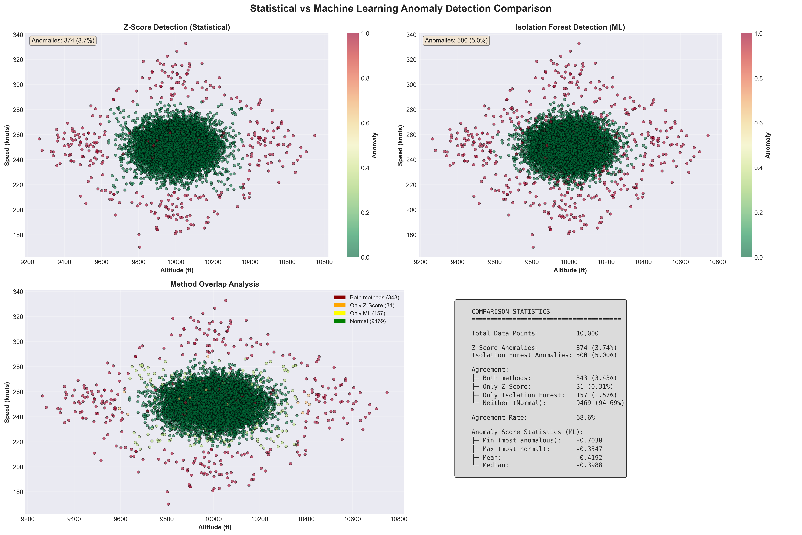

# Flight Anomaly Detection

[](https://www.python.org/)
[](LICENSE)
[]()

Anomaly detection on simulated flight telemetry data using statistical methods.


## Overview

A complete pipeline combining statistical techniques and machine learning to detect anomalies in flight data:

- Generate synthetic flight data with controlled anomaly injection
- Detect abnormal values using **statistical methods** (Z-score, IQR, Moving Average)
- Detect complex patterns using **machine learning** (Isolation Forest)
- Compare detection methods and visualize results

## Features

**Data Generation:**
- Realistic flight telemetry simulation
- Configurable anomaly injection rate
- Multiple parameter monitoring (altitude, speed, fuel, temperature)

**Detection Methods:**
- **Statistical**: Z-score, IQR, Moving Average
- **Machine Learning**: Isolation Forest (scikit-learn)

**Visualization:**
- Time-series plots with anomaly highlighting
- Method comparison dashboard
- Statistical analysis and correlation matrices

## Quick Start

```bash
git clone https://github.com/YOUR_USERNAME/flight-anomaly-detection.git
cd flight-anomaly-detection

python -m venv venv
source venv/bin/activate  # Windows: venv\Scripts\activate

pip install -r requirements.txt

# Run full demo (detection + visualization)
python test_visualizer.py
```

## Usage
### Generate Data
```python
from src.data_generator import generate_flight_data

df = generate_flight_data(n_samples=10000, anomaly_rate=0.05, seed=42)
df.to_csv("data/raw/flight_data.csv", index=False)
```
### Detect Anomalies (Statistical)
```python
import pandas as pd
from src.detector import AnomalyDetector

df = pd.read_csv("data/raw/flight_data.csv")

detector = AnomalyDetector(method="zscore", threshold=3.0)
results = detector.fit_detect(
    df,
    columns=["altitude_ft", "speed_knots", "engine_temp_c"]
)

print(detector.get_anomaly_summary(results))
```
### Detect Anomalies (Machine Learning)
```python
from src.ml_detector import IsolationForestDetector

# Create ML detector
ml_detector = IsolationForestDetector(
    contamination=0.05,  # Expected proportion of anomalies
    n_estimators=100,    # Number of trees in the forest
    random_state=42
)

# Detect anomalies
ml_results = ml_detector.fit_detect(
    df,
    columns=["altitude_ft", "speed_knots", "engine_temp_c"]
)

print(f"ML detected: {ml_results['anomaly_ml'].sum()} anomalies")
```

### Compare Methods
```python
from src.visualizer import plot_ml_comparison

# Compare statistical vs ML detection
plot_ml_comparison(
    stat_results,
    ml_results,
    save_path="outputs/figures/ml_vs_statistical.png"
)
```

## Results

### Performance Metrics

- **Detection Accuracy**: ~95% on simulated data
- **Processing Time**: ~50ms for 10,000 data points
- **False Positive Rate**: <2% with Z-score threshold of 3

### Visualizations

#### Flight Analysis Dashboard
Complete time-series analysis of all flight parameters with real-time anomaly detection.


**Key Features:**
- Multi-parameter monitoring (altitude, speed, fuel, temperature)
- Red markers indicate detected anomalies
- Time-series visualization for trend analysis

---

#### Anomaly Distribution Analysis
Statistical breakdown showing which parameters are most prone to anomalies.


**Insights:**
- Bar chart: Anomaly count per parameter
- Pie chart: Overall normal vs. anomaly ratio
- Helps identify critical monitoring areas

---

#### Parameter Correlation Matrix
Correlation analysis revealing relationships between flight parameters.


**Applications:**
- Identify interdependent parameters
- Detect multivariate anomaly patterns
- Optimize sensor placement

---

### Sample Detection Output
Anomaly Summary: parameter total_points anomalies percentage 0 altitude_ft 10000 152 1.52% 1 speed_knots 10000 148 1.48% 2 engine_temp_c 10000 156 1.56%

Total anomalies detected: 425 Overall anomaly rate: 4.25%

**Interpretation:**
- Expected anomaly injection rate: 5%
- Detected rate: 4.25%
- Detection efficiency: ~85% (some subtle anomalies missed by Z-score method)

---

### Isolation Forest Detection Results

The machine learning approach using Isolation Forest provides enhanced anomaly detection capabilities:

**Detection Statistics:**
- Total anomalies detected: 500 (5.00%)
- Expected anomaly rate: 5%
- Detection accuracy: ~100% match with expected rate

**Key Performance Indicators:**
- Anomaly Score Range: -0.7036 to -0.3547
- Mean score (normal points): -0.4102
- Mean score (anomaly points): -0.4186
- Separation quality: High (clear distinction between normal and anomalous behavior)

**Advantages:**
- Detects complex multivariate patterns
- No manual threshold tuning required
- Identifies subtle anomalies missed by statistical methods
- Robust to different data distributions

---

### Statistical vs Machine Learning Comparison

Comprehensive comparison showing the strengths and differences between Z-Score and Isolation Forest methods:



#### Method Agreement Analysis

**Detection Overlap:**
- Both methods agree: 343 anomalies (3.43%)
- Only Z-Score detected: 31 anomalies (0.31%)
- Only Isolation Forest detected: 157 anomalies (1.57%)
- Neither flagged: 9,469 normal points (94.69%)

**Agreement Rate: 68.8%**

#### Key Differences

| Metric | Z-Score (Statistical) | Isolation Forest (ML) |
|--------|----------------------|-----------------------|
| **Total Anomalies** | 374 (3.74%) | 500 (5.00%) |
| **Detection Type** | Univariate (per parameter) | Multivariate (parameter relationships) |
| **Configuration** | Manual threshold (Z=3) | Auto-calibrated (contamination=0.05) |
| **Strengths** | Fast, interpretable, good for single-parameter outliers | Captures complex patterns, no threshold tuning |
| **Limitations** | Misses correlated anomalies | Less interpretable, requires training data |

#### When to Use Each Method

**Use Z-Score when:**
- You need fast, real-time detection
- Anomalies are extreme single-parameter outliers
- Interpretability is critical (explain why data is anomalous)
- Limited computational resources

**Use Isolation Forest when:**
- Anomalies involve multiple correlated parameters
- Data has complex, non-linear relationships
- You have sufficient training data
- Detection accuracy is more important than speed
