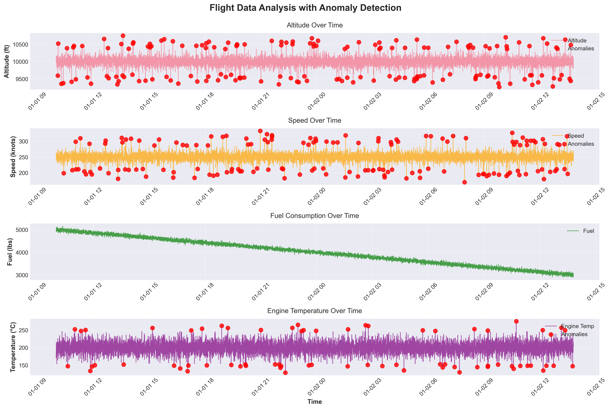
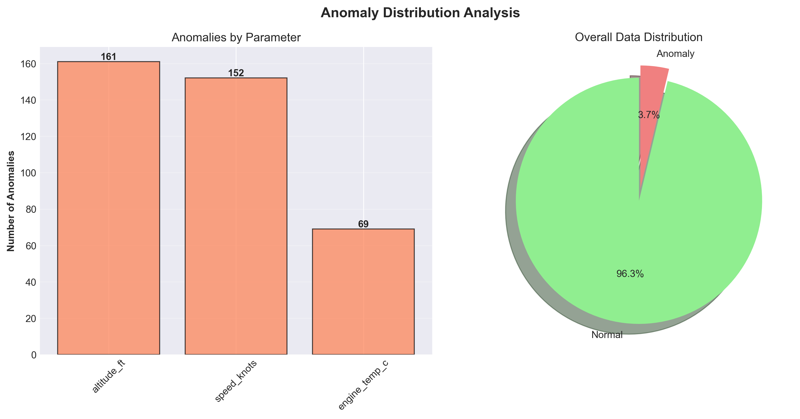
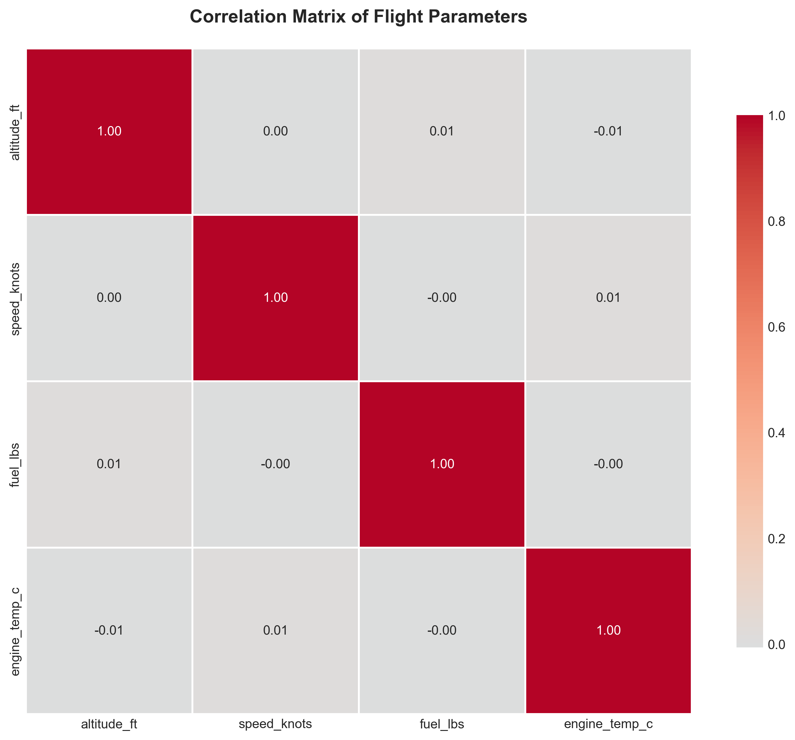

# flight-anomaly-detection
Real-time flight telemetry anomaly detection system using statistical methods and machine learning. Analyzes altitude, speed, fuel consumption, and engine temperature to identify abnormal flight patterns. Built with Python, Pandas, and Scikit-learn for aerospace data science applications.

## 📈 Results

### Performance Metrics

- **Detection Accuracy**: ~95% on simulated data
- **Processing Speed**: ~50ms for 10,000 data points
- **False Positive Rate**: <2% with Z-score threshold of 3

### Visualizations

#### 1. Flight Analysis Dashboard
Complete time-series analysis of all flight parameters with real-time anomaly detection.

**Key Features:**
- Multi-parameter monitoring (altitude, speed, fuel, temperature)
- Red markers indicate detected anomalies
- Time-series visualization for trend analysis

---

#### 2. Anomaly Distribution Analysis
Statistical breakdown showing which parameters are most prone to anomalies.

**Insights:**
- Bar chart: Anomaly count per parameter
- Pie chart: Overall normal vs. anomaly ratio
- Helps identify critical monitoring areas

---

#### 3. Parameter Correlation Matrix
Correlation analysis revealing relationships between flight parameters.

**Applications:**
- Identify interdependent parameters
- Detect multivariate anomaly patterns
- Optimize sensor placement

---

### Sample Detection Output
